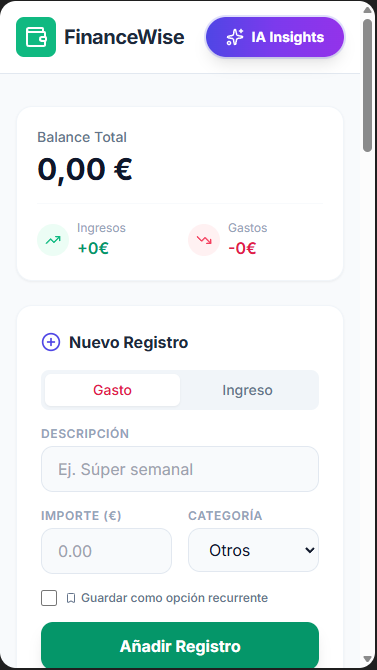
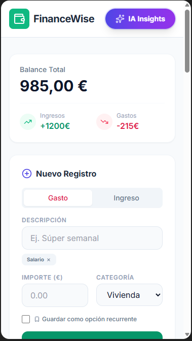
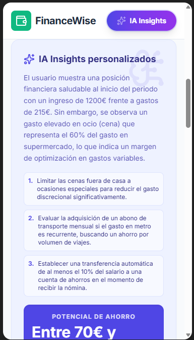

# FIA — AI Finance Assistant

A lightweight personal‑finance accounting assistant.
Built with Google AI Studio (Gemini) to help anyone manage income, expenses, and financial habits in a simple and intuitive way.

## 📸 Dashboard Preview

## What Is FIA?

FIA is a lightweight web application that uses AI models to provide basic financial guidance, answer personal‑accounting questions, and help users better understand their financial situation.

Its goal is to democratize financial education through a clean, accessible interface.

## Key Features

1. Income & Expense Tracking and Analysis  
Explains concepts, categorizes transactions, and helps identify financial patterns.

2. Basic Financial Guidance  
Answers questions about saving, budgeting, debt, and personal planning.

3. Clear, Educational Explanations  
Designed for users with no prior accounting knowledge.

4. Fast, Minimalist Interface  
Built with React + TypeScript for a smooth user experience.

## 🛠️ Tech Stack

Area — Technologies

AI — Google AI Studio (Gemini API)
Frontend — React, TypeScript
Environment — Node.js, Vite
Configuration — Environment variables (.env.local)

## How to Run the App Locally

Follow these steps to run the application on your machine:

__Install Node.js__
Make sure Node.js is installed.

__Install dependencies__

__bash__
npm install

Set up the API key  
Create a .env.local file in the project root and add your Gemini key:

__CODE__
GEMINI_API_KEY=your_api_key_here
Start the development server

__bash__
npm run dev
Open the application  
Visit the URL shown in the console.

## 🌐 Online Version
You can try the app directly in Google AI Studio:
https://ai.studio/apps/9580be97-2be2-4095-9118-8ecc62ee91a4

##  Project Purpose
This project is part of my professional portfolio as a Data Analyst / BI specialist, showcasing:

Integration of generative AI into real applications

Frontend development best practices

Ability to build educational and functional tools

Clear, user‑oriented documentation

-- 

# CASTELLANO

# FIA — Finanzas IA 

Asistente de contabilidad básica para finanzas personales.
Aplicación creada con Google AI Studio (Gemini) para ayudar a cualquier persona a gestionar sus ingresos, gastos y hábitos financieros de forma sencilla e intuitiva.

## 📸 Visualización

## ¿Qué es FIA?
FIA es una aplicación web ligera que utiliza modelos de IA para ofrecer orientación financiera básica, responder preguntas sobre contabilidad personal y ayudar a los usuarios a entender mejor su situación económica.

Su objetivo es democratizar la educación financiera mediante una interfaz simple y accesible.

## Funcionalidades principales
__1. Registro y análisis de ingresos y gastos__

Explica conceptos, clasifica movimientos y ayuda a entender patrones financieros.

__2. Asesoramiento financiero básico__

Responde preguntas sobre ahorro, presupuestos, deudas y planificación personal.

__3. Explicaciones claras y educativas__

Ideal para usuarios sin conocimientos previos de contabilidad.

__4. Interfaz rápida y minimalista__

Construida con React + TypeScript para una experiencia fluida.

## 🛠️ Tecnologías utilizadas ## 
__Área	Tecnologías__

IA	Google AI Studio (Gemini API)
Frontend	React, TypeScript
Entorno	Node.js, Vite
Configuración	Variables de entorno (.env.local)

## Cómo ejecutar la app localmente ##
Sigue estos pasos para correr la aplicación en tu equipo:

__Instalar Node.js__
Asegúrate de tener Node.js instalado.

__Instalar dependencias__

__bash__
npm install
Configurar la clave de API  
Crea un archivo .env.local en la raíz del proyecto e incluye tu clave de Gemini:

__Código__
GEMINI_API_KEY = tu_api_key_aquí
Iniciar el servidor de desarrollo

__bash__
npm run dev
Abrir la aplicación  
Accede desde tu navegador a la URL que aparece en consola.

## 🌐 __Versión online__ 
Puedes ver la app directamente desde Google AI Studio:
https://ai.studio/apps/9580be97-2be2-4095-9118-8ecc62ee91a4

## Objetivo del proyecto 
Este proyecto forma parte de mi portfolio profesional como Analista de Datos / BI, demostrando:

Integración de IA generativa en aplicaciones reales

Buenas prácticas de desarrollo frontend

Capacidad para crear herramientas educativas y funcionales

Documentación clara y orientada al usuario

# Run and deploy your AI Studio app

This contains everything you need to run your app locally.

View your app in AI Studio: https://ai.studio/apps/9580be97-2be2-4095-9118-8ecc62ee91a4

## Run Locally

**Prerequisites:**  Node.js

1. Install dependencies:
   `npm install`
2. Set the `GEMINI_API_KEY` in [.env.local](.env.local) to your Gemini API key
3. Run the app:
   `npm run dev`
